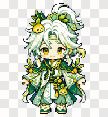
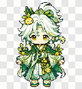
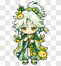
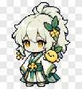
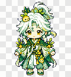
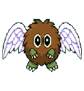
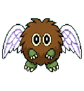
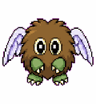
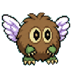
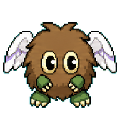

# Codex Pets

A small collection of Codex pet packages.

## Pets

<table>
<tr><th>Name</th><td colspan="5"><a href="./finished/beret-bear">Beret Bear</a></td></tr>
<tr><th>Files</th><td colspan="5"><code>finished/beret-bear/pet.json</code> and <code>finished/beret-bear/spritesheet.webp</code></td></tr>
<tr><th>Action</th><td><strong>Idle</strong></td><td><strong>Waving</strong></td><td><strong>Running</strong></td><td><strong>Waiting</strong></td><td><strong>Review</strong></td></tr>
<tr><th>Preview</th><td></td><td></td><td></td><td></td><td></td></tr>
</table>

<table>
<tr><th>Name</th><td colspan="5"><a href="./finished/sangqi-TYY">sangqi-TYY</a></td></tr>
<tr><th>Files</th><td colspan="5"><code>finished/sangqi-TYY/pet.json</code> and <code>finished/sangqi-TYY/spritesheet.webp</code></td></tr>
<tr><th>Action</th><td><strong>Idle</strong></td><td><strong>Waving</strong></td><td><strong>Running</strong></td><td><strong>Waiting</strong></td><td><strong>Review</strong></td></tr>
<tr><th>Preview</th><td></td><td></td><td></td><td></td><td></td></tr>
</table>

<table>
<tr><th>Name</th><td colspan="5"><a href="./finished/winged-kuriboh">Winged-Kuriboh</a></td></tr>
<tr><th>Files</th><td colspan="5"><code>finished/winged-kuriboh/pet.json</code> and <code>finished/winged-kuriboh/spritesheet.webp</code></td></tr>
<tr><th>Action</th><td><strong>Idle</strong></td><td><strong>Waving</strong></td><td><strong>Running</strong></td><td><strong>Waiting</strong></td><td><strong>Review</strong></td></tr>
<tr><th>Preview</th><td></td><td></td><td></td><td></td><td></td></tr>
</table>
